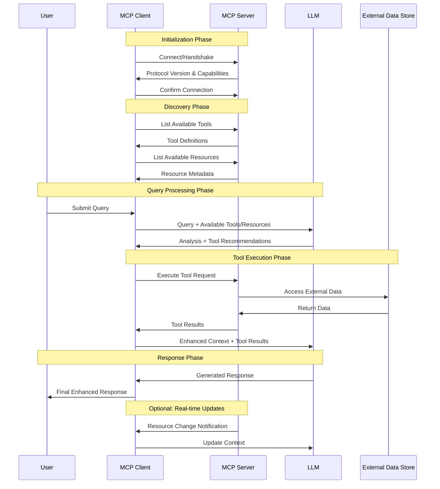

# Corrected MCP Sequence Diagram

Here's the corrected Mermaid sequence diagram code with variable names to avoid syntax errors:

## Key Changes Made:

1. **Variable Names**: Used short variable names (U, MC, MS, L, EDS) instead of full names with spaces
2. **Participant Declarations**: Each participant is declared with `participant [variable] as [full name]`
3. **References**: All sequence arrows use the variable names (e.g., `MC->>MS` instead of `MCP Client->>MCP Server`)

This syntax avoids the spaces that were causing the syntax error in your original diagram.